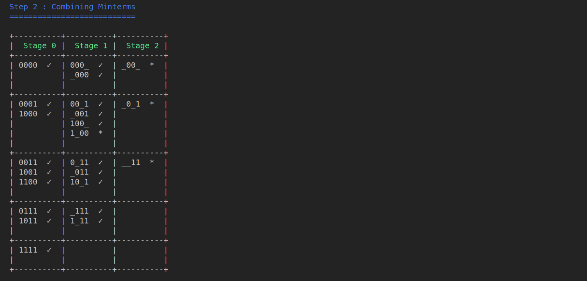

# Quine McCluskey Circuit Minimizer

A CLI tool for minimizing sum of products via the Quine McCluskey minimization technique. 

## Features
   * Written in uncomplicated python
   * Supports don't cares and variables for representing expression
   * Display of all steps leading to solution
   * Works on Mac, Linux and Windows
   
## Installation
1. Clone the repo
```bash
   git clone https://github.com/Kumbong/quine_mccluskey.git
   cd quine_mccluskey
```
2. Install dependencies
```bash
   pip install -r requirements.txt
```

## Usage
You can use the following optional arguments according to your needs: 

   * `-d`, `--dcares` (list of numbers): **list of dont't cares (default=[ ])**
   * `-v`, `--variables` (list of chars): **list of characters for representing result (default = [ ])**
   * `-s`, `--show_steps` (yes|no): **show steps leading to solution (default=yes)**
   
Example
```bash
    python -m qmccluskey 0,1,3,7,8,9,11,15 -d 12  -v a,b,c,d
```

## Demo
   Solution for the the Example above
   
   
   
   
   
   
## Contributing
Pull requests are welcome. For major changes, please open an issue first to discuss what you would like to change.
Please make sure to update tests as appropriate.

## References
* Petrick's method 
    https://en.wikipedia.org/wiki/Petrick%27s_method
* quine mccluskey also in python
    https://github.com/tpircher/quine-mccluskey
* readme.md
    https://github.com/karan/joe

### Todos

 - Complete GUI module
 - Write tests
 - Include steps for petrick's method


License
----

MIT &copy; Kumbong Hermann

